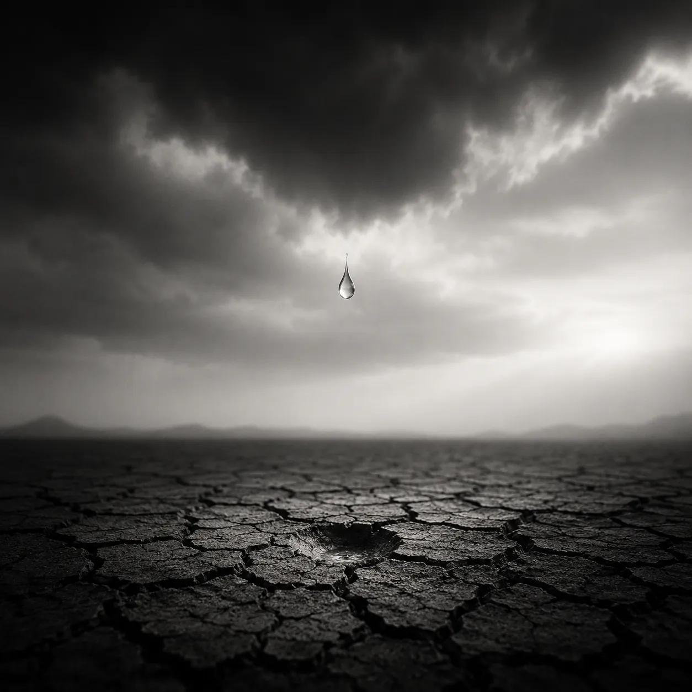

பூமி, வானை காதலித்தது!
நெடுநாள் பூமியை காதலித்த
மேகமோ, கண்மூடி கதறி,
கண்ணீரை வடித்தது!

மேகம் வடித்த கண்ணீர் - பூமியை
சோகம் ஆக்கியது!
தாகம் தீர்க்கும் மேகம் - என் மேல்
மோகம் கொண்டுள்ளதா? 

வேகமாய் சுழன்று பூமி,
மேகத்தை கலைத்தது!
தேகத்தை மறைத்து, பச்சை
பாகமாய் ஆக்கியது!

மீண்டும் வானோடு
முத்தக்காதல் முகிழ்ந்தது!
முத்தத்தால் நீர் பரிமாற்றம்
முன்போலே ஈடேறியது!

கண்டு கடும்வலியால்
கார்மேக சொந்தங்கள்
கண்ணீர் வடித்து 
காதலால் உருகினர்!

கண்ணீர் தீர்ந்தாலும்,
காதல் தீருவதில்லை!
ஆகாயமேகங்கள் பொழிகையில்,
ஆதாயம் தேடுவதில்லை!
